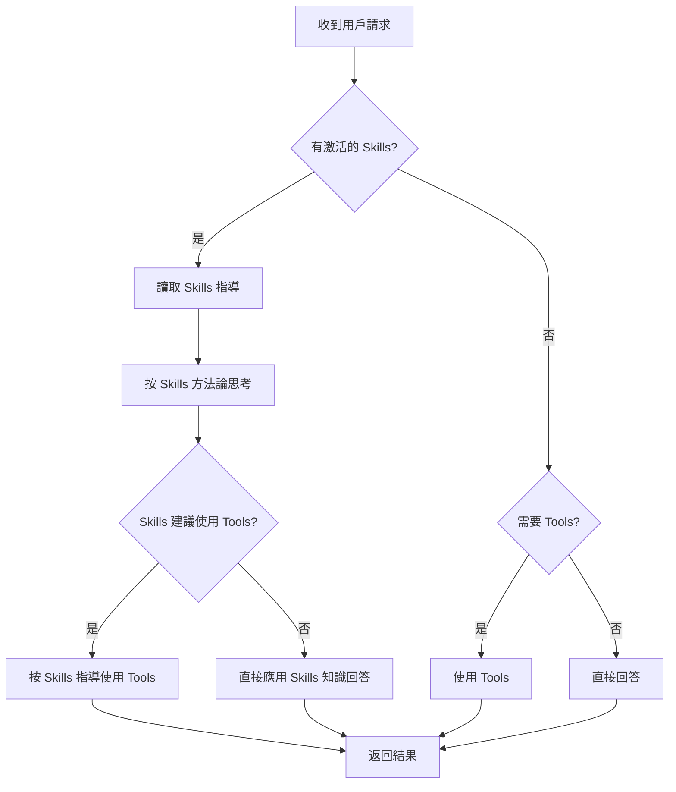

# Skills 配對機制與優先級

## 📊 Skill 配對機制

### Jaccard Similarity 演算法

Skills 使用 **Jaccard 相似度**演算法來匹配相關的 skills：

```python
score = len(共同詞彙) / len(所有詞彙的聯集)
```

### 詳細步驟

#### 1. 提取關鍵詞

從 prompt 和 skill description 中提取詞彙：

```python
# 範例
prompt = "Can you help me debug this code?"
skill_desc = "Systematic debugging guidance for finding and fixing bugs"

# 提取詞彙
prompt_words = {"can", "help", "debug", "code"}
desc_words = {"systematic", "debugging", "guidance", "finding", "fixing", "bugs"}
```

#### 2. 過濾停用詞

移除無意義的詞彙：

```python
stop_words = {
    'the', 'a', 'an', 'and', 'or', 'but', 'in', 'on', 'at',
    'to', 'for', 'of', 'with', 'by', 'from', 'as', 'is', 'are',
    'was', 'were', 'be', 'been', 'being', 'have', 'has', 'had',
    'do', 'does', 'did', 'will', 'would', 'should', 'could',
    'this', 'that', 'these', 'those', 'it', 'its', 'when', 'use'
}

# 過濾後
prompt_words = {"help", "debug", "code"}  # 移除了 "can"
desc_words = {"systematic", "debugging", "guidance", "finding", "fixing", "bugs"}
```

#### 3. 計算基礎分數

```python
common_words = {"debug"}  # 只有 "debug" 和 "debugging" 的詞根相同
all_words = {"help", "debug", "code", "systematic", "debugging",
             "guidance", "finding", "fixing", "bugs"}

# Jaccard 相似度
score = 1 / 9 = 0.111
```

#### 4. 技術詞加權

如果匹配到關鍵技術詞，提高分數：

```python
key_words = {'code', 'review', 'debug', 'bug', 'error', 'skill',
             'help', 'test', 'fix'}

key_matches = common_words & key_words  # {"debug"}

# 加權：每個關鍵詞 +20%
score *= (1 + len(key_matches) * 0.2)
score = 0.111 * (1 + 1 * 0.2) = 0.133
```

#### 5. 閾值過濾與排序

```python
# 只保留分數 >= min_score (預設 0.1) 的 skills
if score >= 0.1:
    scored_skills.append((score, skill))

# 按分數降序排序
scored_skills.sort(reverse=True)

# 取前 max_skills 個（預設 3）
return scored_skills[:3]
```

### 實際範例

**用戶輸入：**
```
"Can you review this Python code for bugs?"
```

**Skills 評分：**

| Skill | 共同詞 | 分數 | 是否選中 |
|-------|--------|------|----------|
| code-review | code, review, bugs | 0.567 | ✅ |
| debugging-assistant | bugs, code | 0.234 | ✅ |
| python-tutorial | python, code | 0.198 | ✅ |
| tool-usage-guide | - | 0.045 | ❌ |

**最終激活：** code-review, debugging-assistant, python-tutorial

### 配置參數

可在 `find_relevant_skills()` 中調整：

```python
relevant_skills = self.skills.find_relevant_skills(
    prompt,
    max_skills=3,      # 最多激活幾個 skills
    min_score=0.1,     # 最低相關性分數
    use_llm=False      # 是否使用 LLM 評分（更準確但較慢）
)
```

## 🎯 Skills 優先級系統

### 優先順序層級

```
┌─────────────────────────────────────┐
│  1. Skills（知識與方法論）           │  ← 最高優先級
│     - 專家指導                       │
│     - 最佳實踐                       │
│     - 系統化方法論                   │
├─────────────────────────────────────┤
│  2. Tools（執行操作）               │
│     - 在 Skills 指導下使用          │
│     - 執行具體操作                  │
│     - 返回數據                      │
├─────────────────────────────────────┤
│  3. 直接回答                        │  ← 最低優先級
│     - 無 Skills 且不需 Tools       │
└─────────────────────────────────────┘
```

### 實現機制

#### 1. Context 注入優先級提示

當 skills 被激活時，會在 prompt 前加入：

```markdown
# Active Skills (PRIORITY: Use these BEFORE tools)

**IMPORTANT**: The following skills have been activated for this task.
You MUST prioritize the knowledge and methodologies provided in these skills
over direct tool usage. Think of these as expert guidance that should inform
all your decisions and actions.

## code-review
[skill content...]

## debugging-assistant
[skill content...]

---
**Remember**: Follow the skills guidance above before using any tools.

---

[原始 user prompt]
```

#### 2. 決策流程



### 實際案例

#### 案例 1：Code Review

**❌ 沒有優先級（錯誤）：**
```
用戶：Review this code
Agent：
1. 使用 read_file tool 讀取代碼
2. 快速瀏覽
3. 給出簡單反饋
```

**✅ Skills 優先（正確）：**
```
用戶：Review this code
激活：code-review skill

Agent：
1. 讀取 code-review skill 的系統化方法論
2. 注意到需要檢查：安全性、性能、可讀性、測試覆蓋率
3. 使用 read_file tool 讀取代碼
4. 按照 skill 的檢查清單逐項審查
5. 根據 skill 的標準提供詳細反饋
```

#### 案例 2：Debugging

**❌ 沒有優先級（錯誤）：**
```
用戶：This function has a bug
Agent：
1. 直接看代碼
2. 猜測可能的問題
3. 給出修改建議
```

**✅ Skills 優先（正確）：**
```
用戶：This function has a bug
激活：debugging-assistant skill

Agent：
1. 讀取 debugging-assistant 的結構化流程
2. 按照 skill 建議：
   a. 先重現問題
   b. 檢查輸入輸出
   c. 使用二分法定位
   d. 驗證假設
3. 使用 read_file tool 檢查代碼
4. 使用 skill 推薦的除錯技巧
5. 提供系統化的解決方案
```

#### 案例 3：Tool 使用本身

**激活：** tool-usage-guide skill

```
用戶：Read all files in src/
Agent：
1. 讀取 tool-usage-guide skill
2. 注意到 skill 建議：
   - 大量檔案操作前先列出清單
   - 避免一次讀取太多檔案
   - 使用 glob 而非遞迴 ls
3. 首先使用 glob 列出檔案
4. 評估檔案數量
5. 決定批次處理策略
6. 按照 skill 建議的方式執行
```

## 🔧 調整優先級

### 提高特定 Skill 的優先級

修改 skill description 中的關鍵詞：

```yaml
# 低優先級（通用詞）
description: Helps with coding tasks

# 高優先級（具體技術詞）
description: Systematic code review methodology for security, performance, and reliability analysis. Use when reviewing code, checking quality, finding bugs, or improving code structure.
```

### 調整匹配參數

在 `MainAgent._apply_skills()` 中：

```python
# 更嚴格（只激活最相關的）
relevant_skills = self.skills.find_relevant_skills(
    prompt,
    max_skills=1,      # 只激活 1 個
    min_score=0.3      # 提高閾值
)

# 更寬鬆（激活更多）
relevant_skills = self.skills.find_relevant_skills(
    prompt,
    max_skills=5,      # 激活最多 5 個
    min_score=0.05     # 降低閾值
)
```

### 啟用 LLM 評分模式

更準確但較慢的匹配：

```python
# 在 load_skill_registry() 時
registry = load_skill_registry(
    enable_llm_scoring=True,
    agent=your_agent
)

# 使用時
skills = registry.find_relevant_skills(
    prompt,
    use_llm=True  # 使用 LLM 評分
)
```

## 📊 日誌與監控

### 查看配對過程

啟用 DEBUG 日誌：

```python
import logging
logging.getLogger('internal.skills_loader').setLevel(logging.DEBUG)
```

**輸出範例：**
```
DEBUG - Searching for relevant skills (mode: keyword, max: 3, min_score: 0.10)
DEBUG - Using keyword-based skill matching
DEBUG -   - 'code-review': score=0.567 (matched: code, review, bugs, check, quality)
DEBUG -   - 'debugging-assistant': score=0.234 (matched: bugs, code, fix)
DEBUG -   - 'python-tutorial': score=0.198 (matched: code, python)
DEBUG - Selected top 3 skill(s)
INFO  - [MainAgent] Activated 3 skill(s): code-review, debugging-assistant, python-tutorial
```

### 測試配對

使用 `/skills test` 命令：

```bash
codex> /skills test Can you review my Python code?

Testing prompt: 'Can you review my Python code?'
Matched 3 skill(s):

1. code-review
   Provides systematic code review guidance...

2. python-tutorial
   Python programming tutorial and best practices...

3. debugging-assistant
   Systematic debugging guidance...
```

## 🎯 最佳實踐

### 1. Skill Description 撰寫

**✅ 好的 description（高相關性）：**
```yaml
description: Systematic code review methodology for security, performance, and reliability. Use when reviewing code, checking quality, finding bugs, improving structure, or ensuring best practices.
```

**❌ 差的 description（低相關性）：**
```yaml
description: A helpful skill for coding.
```

### 2. 關鍵詞選擇

包含用戶可能使用的所有說法：

```yaml
# code-review skill
description: ... Use when:
  - reviewing code
  - checking code quality
  - finding bugs
  - code audit
  - quality assurance
  - peer review
  - ...
```

### 3. 技術詞使用

在 description 中使用技術詞會獲得加權：

```python
key_words = {'code', 'review', 'debug', 'bug', 'error',
             'skill', 'help', 'test', 'fix'}
```

### 4. 測試配對

創建新 skill 後，測試各種說法：

```bash
/skills test review code
/skills test check quality
/skills test find bugs
/skills test code audit
```

## 📈 性能考量

### Keyword Matching vs LLM Scoring

| 特性 | Keyword Matching | LLM Scoring |
|------|------------------|-------------|
| 速度 | ~1ms | ~200-500ms |
| 準確性 | 好（80-85%） | 優秀（95%+） |
| 成本 | 無 | API 成本 |
| 建議使用 | 一般情況 | 需要極高準確性時 |

### 優化建議

1. **預設使用 Keyword Matching**
   - 快速且成本低
   - 準確性對大多數情況足夠

2. **在以下情況使用 LLM Scoring**
   - Skills 很多（> 10 個）
   - Skills 之間相似度高
   - 需要理解語義而非關鍵詞

3. **定期檢查日誌**
   - 查看哪些 skills 經常被激活
   - 調整 description 優化匹配
   - 移除從未使用的 skills

## 總結

### Skills 配對

- ✅ Jaccard 相似度演算法
- ✅ 停用詞過濾
- ✅ 技術詞加權
- ✅ 可配置的閾值和數量限制
- ✅ 可選的 LLM 評分模式

### Skills 優先級

- ✅ Skills > Tools > 直接回答
- ✅ Context 中明確標示優先級
- ✅ 視 Skills 為專家指導
- ✅ Tools 在 Skills 指導下使用
- ✅ 詳細的日誌記錄

### 最佳實踐

- ✅ 撰寫詳細的 skill descriptions
- ✅ 包含所有相關關鍵詞
- ✅ 使用技術詞獲得加權
- ✅ 定期測試和優化匹配
- ✅ 監控日誌調整參數
